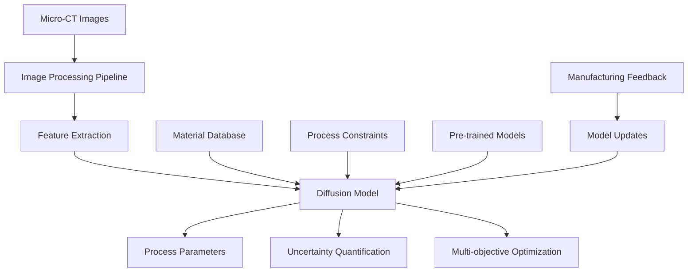

# Architecture Overview

MicroDiff-MatDesign is a comprehensive framework for AI-driven inverse materials design using diffusion models. The system transforms target microstructural properties into optimal manufacturing process parameters.

## System Architecture



## Core Components

### 1. Core Module (`microdiff_matdesign.core`)
**Primary Classes:**
- `MicrostructureDiffusion`: Main orchestration class
- `InverseDesignPipeline`: End-to-end workflow management
- `ModelRegistry`: Pre-trained model management

**Responsibilities:**
- High-level API for common workflows
- Model lifecycle management (load, train, inference)
- Configuration and parameter validation
- Result post-processing and visualization

### 2. Models Module (`microdiff_matdesign.models`)
**Architecture Components:**
- `DiffusionUNet3D`: 3D volumetric diffusion model
- `DiffusionTransformer`: Attention-based architecture
- `ConditionalGeneration`: Multi-modal conditioning
- `UncertaintyQuantification`: Bayesian inference layers

**Model Pipeline:**
```
Input Conditioning → Noise Prediction → Denoising Steps → Parameter Output
```

### 3. Imaging Module (`microdiff_matdesign.imaging`)
**Processing Pipeline:**
- `MicroCTLoader`: Multi-format image loading
- `VolumePreprocessor`: Denoising, artifact removal
- `PhaseSegmentation`: Multi-phase material identification
- `FeatureExtractor`: Quantitative microstructure analysis

**Supported Features:**
- Grain size distribution
- Phase fractions and morphology
- Texture coefficients
- Porosity analysis
- Surface roughness metrics

### 4. Process Modules (`microdiff_matdesign.processes`)
**Manufacturing Processes:**
- `LPBFOptimizer`: Laser Powder Bed Fusion
- `EBMOptimizer`: Electron Beam Melting
- `DEDOptimizer`: Directed Energy Deposition

**Optimization Framework:**
- Multi-objective parameter spaces
- Manufacturing constraints
- Process-specific physics models
- Quality prediction integration

### 5. Datasets Module (`microdiff_matdesign.datasets`)
**Data Management:**
- `MicrostructureDataset`: Training data pipelines
- `DataAugmentation`: Synthetic data generation
- `ValidationSplits`: Cross-validation strategies
- `MetricsTracking`: Performance monitoring

## Data Flow Architecture

### Training Pipeline
1. **Data Ingestion**: Load micro-CT volumes and parameter labels
2. **Preprocessing**: Normalize, augment, and feature extraction
3. **Model Training**: Diffusion model optimization with conditioning
4. **Validation**: Cross-validation and performance metrics
5. **Model Serialization**: Save trained models and metadata

### Inference Pipeline
1. **Input Processing**: Load and preprocess target microstructure
2. **Feature Extraction**: Quantitative microstructure descriptors
3. **Conditional Generation**: Generate parameter distributions
4. **Post-processing**: Apply constraints and optimization
5. **Uncertainty Analysis**: Quantify prediction confidence
6. **Result Visualization**: Generate reports and plots

## Design Principles

### 1. Modularity and Extensibility
- **Plugin Architecture**: Easy addition of new processes/alloys
- **Interface Contracts**: Well-defined APIs between components
- **Dependency Injection**: Configurable model and processing components

### 2. Performance and Scalability
- **GPU Acceleration**: Automatic device management (CPU/GPU)
- **Memory Optimization**: Efficient handling of large 3D volumes
- **Batch Processing**: Vectorized operations for multiple samples
- **Distributed Training**: Multi-GPU and multi-node support

### 3. Reliability and Robustness
- **Error Handling**: Graceful degradation and informative errors
- **Input Validation**: Comprehensive parameter and data validation
- **Fallback Strategies**: CPU implementations for GPU-unavailable environments
- **Monitoring**: Performance and accuracy tracking

### 4. Usability and Developer Experience
- **Simple API**: High-level functions for common tasks
- **Rich Documentation**: Examples, tutorials, and API references
- **Debugging Tools**: Visualization and introspection utilities
- **Configuration Management**: YAML/JSON based configuration

## Extension Points

### Adding New Alloys
1. Create alloy configuration in `configs/alloys/`
2. Add material properties and phase diagrams
3. Implement alloy-specific preprocessing if needed
4. Train models with alloy-specific datasets

### Adding New Processes
1. Inherit from `BaseProcessOptimizer`
2. Implement process-specific parameter spaces
3. Define manufacturing constraints
4. Add process physics models

### Custom Model Architectures
1. Inherit from `BaseDiffusionModel`
2. Implement forward and reverse diffusion
3. Define conditioning mechanisms
4. Register in model factory

## Security and Compliance

### Data Security
- **Input Sanitization**: Validate all user inputs
- **Secure Model Loading**: Verify model integrity
- **Privacy Protection**: No sensitive data logging
- **Access Controls**: Role-based access for enterprise deployments

### Reproducibility
- **Deterministic Operations**: Fixed random seeds for reproducible results
- **Version Tracking**: Model and data version management
- **Experiment Logging**: Comprehensive experiment metadata
- **Audit Trails**: Track all model predictions and parameters

## Performance Characteristics

### Computational Requirements
- **Training**: 8-32 GB GPU memory, 100-1000 GPU hours
- **Inference**: 2-8 GB GPU memory, <1 second per sample
- **Storage**: 100MB-1GB per trained model
- **Memory**: 1-16 GB RAM for large volume processing

### Accuracy Targets
- **Parameter Prediction**: <5% MAE for key parameters
- **Uncertainty Calibration**: Well-calibrated confidence intervals
- **Microstructure Reconstruction**: >0.95 SSIM similarity
- **Process Feasibility**: >95% manufacturable predictions

---

For implementation details, see:
- [Development Guide](DEVELOPMENT.md)
- [Architecture Decision Records](adr/README.md)
- [API Documentation](https://microdiff-matdesign.readthedocs.io)